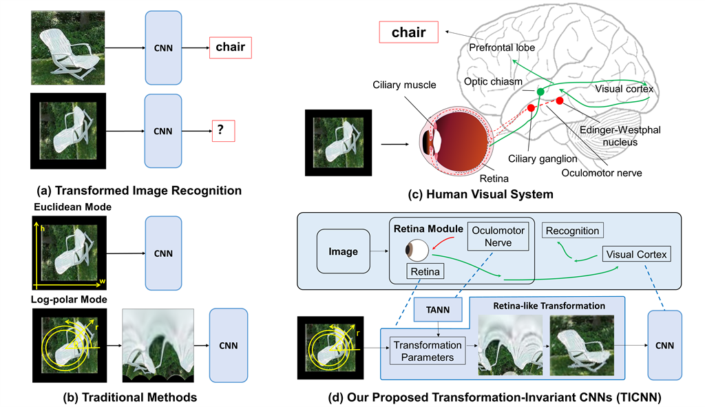
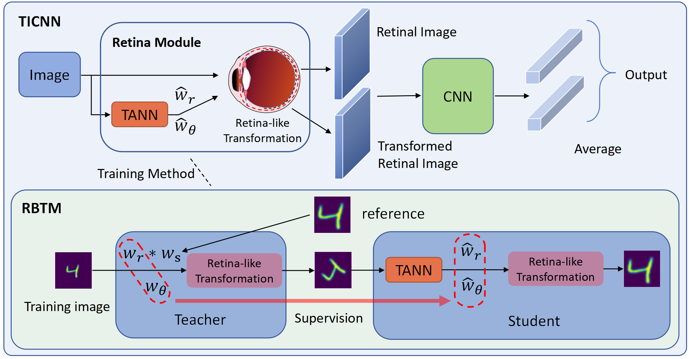

# TICNN

The code of paper “Enabling Scale and Rotation Invariance in Convolutional Neural Networks with Retina Like Transformation”

This paper has been accepted by Neural Networks, and the code is now releasing gradually.

<figure style="text-align: center;">
    
    <figcaption>Figure 1: Overview</figcaption>
</figure>

<figure style="text-align: center;">
    
    <figcaption>Figure 2: Model Architecture</figcaption>
</figure>

## For MNIST Large Scale dataset:

- **Download the dataset**:
  - Download the dataset from [MNIST Large Scale, Jansson and Lindeberg (2021)](https://zenodo.org/record/3820247) and put it in `/zjh/data/`.

- **Training**:
  - Run the following command to train the model:
    ```bash
    cd Scale
    python main_TICNN_LeNet_LS.py
    ```

- **Testing**:
  - Run the following command to test the model:
    ```bash
    cd Scale
    python main_TICNN_LeNet_LS_test.py
    ```

## Reference

Please cite the following paper if you use this code in your research:

```bibtex
@article{zhang2025enabling,
  title={Enabling scale and rotation invariance in convolutional neural networks with retina like transformation},
  author={Zhang, Jiahong and Li, Guoqi and Su, Qiaoyi and Cao, Lihong and Tian, Yonghong and Xu, Bo},
  journal={Neural Networks},
  pages={107395},
  year={2025},
  publisher={Elsevier}
}